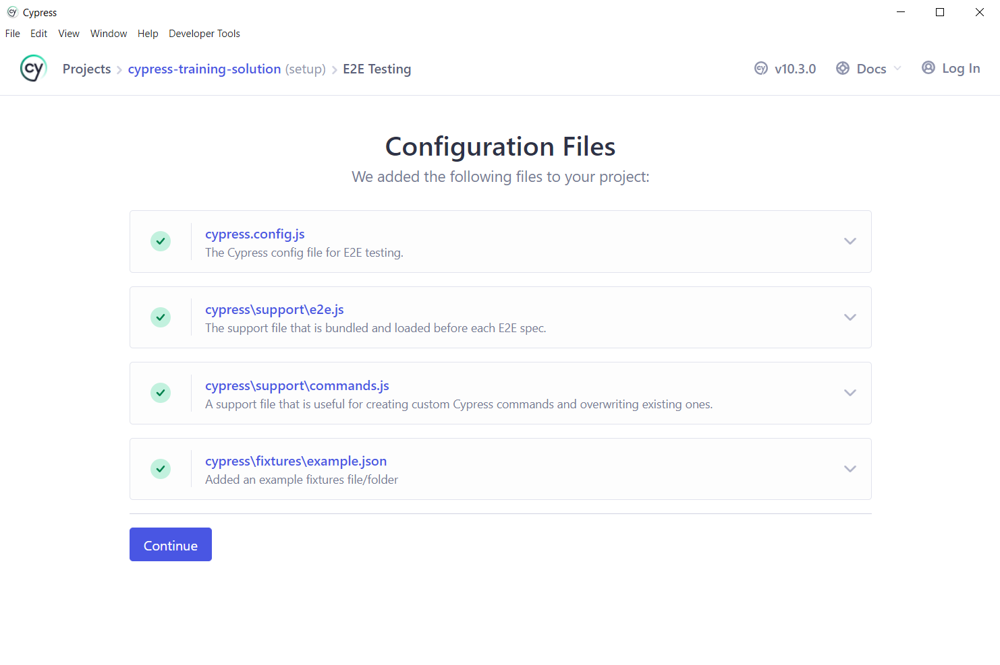
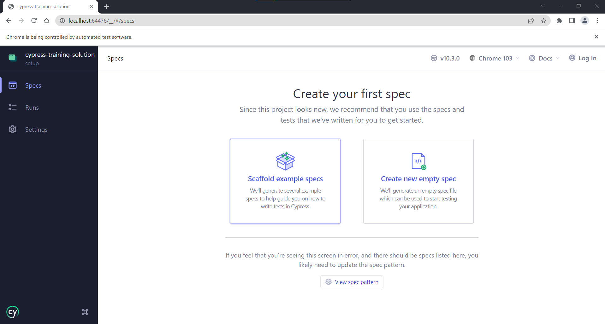
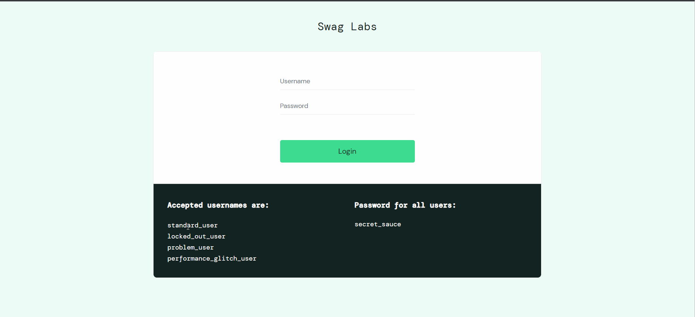
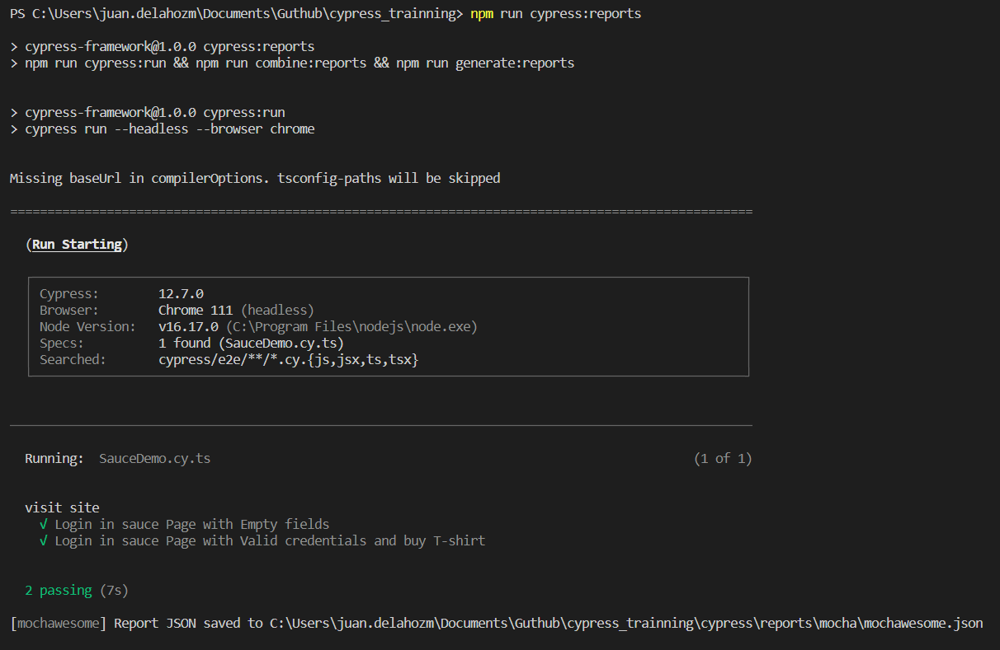
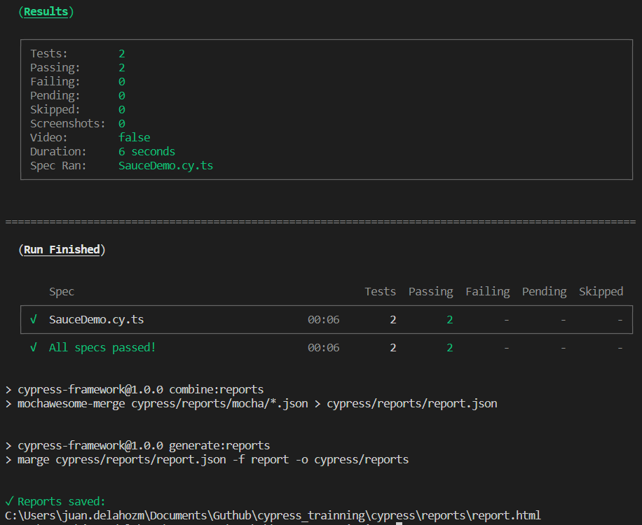
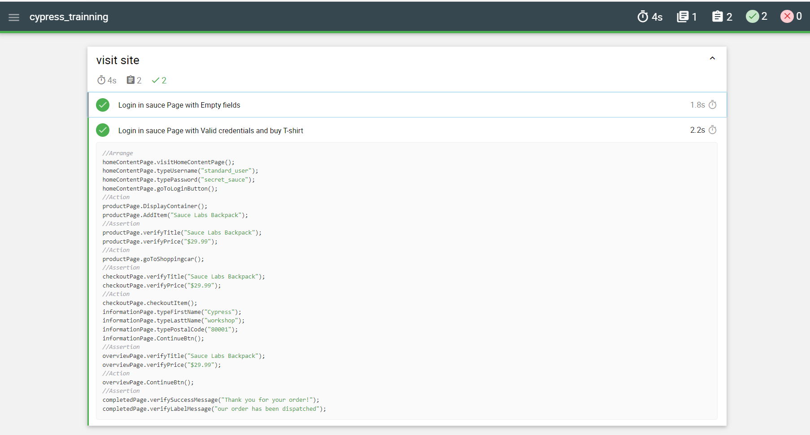

# Workshop Cypress

Bienvenido al Workshop de Cypress!!! Durante el taller exploraremos los conocimientos necesarios para construir pruebas automatizadas desde la interfaz gráfica (GUI) usando Cypress. Durante el taller exploraremos la configuración de un proyecto desde cero, prepararlo para un proceso de integración continua por medio de GitHub Actions, interactuar con diferentes componentes y mucho más.

Para el desarrollo del taller usaremos [GitHub](https://github.com/), [GitHub Flow](https://guides.github.com/introduction/flow/), [GitHub Actions](https://docs.github.com/en/actions/learn-github-actions/understanding-github-actions), [NodeJS](https://nodejs.org/en/), [Cypress](https://www.cypress.io/) y TypeScript para realizar la entrega del ejercicio práctico.

Ten en cuenta tener estudiados ciertos conceptos importantes (te dejamos unos enlaces :sunglasses:):

- [Git](https://www.freecodecamp.org/news/learn-the-basics-of-git-in-under-10-minutes-da548267cc91/)
- [JavaScript](https://javascript.info/)

**Tips de GitHub Flow:**

1. Para cada ejercicio crear una rama (Investiga: _gitflow naming conventions_ )
2. Crea un Pull Request por cada punto (**Recuerda las interacciones como comentarios en inglés**)
3. Después de que se recibe aprobación de cada punto se debe hacer merge de la rama, utilizando squash.
4. Antes de empezar un nuevo punto se debe hacer pull de main para asegurarnos que tenemos los últimos cambios del anterior punto.

## Tabla de contenidos

1. [Creación y configuración del repositorio](#1-creación-y-configuración-del-repositorio)
1. [Configuración inicial del proyecto](#2-configuración-inicial-del-proyecto)
1. [Instalación de Cypress](#3-instalación-de-cypress)
1. [Creando la primera prueba](#4-creando-la-primera-prueba)
1. [Configurando las pruebas con TypeScript](#5-configurando-las-pruebas-con-typescript)
1. [Análisis de código estático](#6-análisis-de-código-estático)
1. [Configurar Integración Continua (CI)](#7-configurar-integración-continua-ci)
1. [Selectores CSS](#8-selectores-css)
1. [Page Object Model (POM)](#9-page-object-model-pom)
1. [Mejorando los selectores](#10-mejorando-los-selectores)
1. [AAA pattern](#11-aaa-pattern)
1. [Listas de elementos, filtros y elementos dentro de elementos](#12-listas-de-elementos-filtros-y-elementos-dentro-de-elementos)
1. [Mejorando los reportes - Mochawesome](#13-mejorando-los-reportes---mochawesome)
1. [Filling form](#14-filling-form)
1. [Subiendo un archivo](#15-subiendo-un-archivo)
1. [Descargando un archivo](#16-descargando-un-archivo)
1. [Interactuando con IFrames](#17-interactuando-con-iframes)

## 1. Creación y configuración del repositorio

1.1. Crear un repositorio en GitHub con el nombre de **cypress-training** (previo requisito disponer de una cuenta en GitHub, no seleccione ninguna opción de inicialización de repositorio).

1.2. Crear localmente una carpeta con el nombre de **cypress-training** y luego sitúese dentro de la carpeta.

1.3. Crear el archivo **.gitignore** en la raíz del proyecto, luego ingrese a la página <https://www.toptal.com/developers/gitignore> y en el campo de texto digite su sistema operativo (ej: windows, osx, macOS) y selecciónelo de la lista de autocompletar. Repita este paso para su entorno de desarrollo (ej:VsCode, Sublime, Intellij, JetBrains), también agregue la palabra `node` y por último `CypressIO`. Presione el botón "Create" para crear el archivo que contendrá una lista de carpetas y archivos de exclusión y copie su contenido dentro del archivo **.gitignore**.

Adicionalmente agregue a su archivo **.gitignore** las siguientes líneas para no subir las pruebas que hacen parte del demo:

   ```bash
   cypress/e2e/1-getting-started/*
   cypress/e2e/2-advanced-examples/*
   ```

1.4. A continuación realice el primer commit y suba los cambios en su repositorio remoto de GitHub, digitando los siguientes comandos en tu consola (cada línea es un comando distinto):

   ```bash
   echo "# cypress-training" >> README.md
   git init -b main
   git add README.md
   git add .gitignore
   git commit -m "first commit"
   git remote add origin https://github.com/<usuario>/cypress-training.git
   git push -u origin main
   ```

  > <b><u>Nota:</b></u> debé reemplazar `<usuario>` por su usuario de GitHub.

1.5. Protege la rama `main` para que los pull request requieran revisión de otros desarrolladores, esto te permite comprobar el estado de nuestros test ("OK" :heavy_check_mark: o "fallaron" :x:) antes de hacer un merge en la rama.

> Ir a Settings > Branches adicionamos una regla dando click en **add rule**. Escribimos `main` en el campo de **branch name pattern**. Una vez hecho eso, damos click en las siguientes opciones:
> 

1.6. Si tiene un mentor asignado, agrega a tu mentor como colaborador, adicionalmente, también puedes agregar a las siguientes personas (quienes te podrán ayudar, en la medida que su tiempo se los permita):

- [holgiosalos](https://github.com/holgiosalos)
- [aperdomob](https://github.com/aperdomob)
- [manuelq12](https://github.com/manuelq12)
- [JuanDelahozMiranda](https://github.com/JuanDelahozMiranda)

## 2. Configuración inicial del proyecto

2.1. Instalar la última versión LTS disponible de Node.js.

**Notas:**

- Hemos probado este workshop con las versiones `v14.X.0`, `v16.X.0` y `v18.X.0`, No necesariamente tiene que instalar una de las versiones anteriores mencionadas, pero si recomendamos instalar una versión LTS.

2.2. Crear una nueva rama local ejecutando por consola `git checkout -b setup`.

2.3. Crear una carpeta en la raíz del proyecto llamada `.github` con un archivo llamado `CODEOWNERS` (sin extensión) con lo siguiente:

   ```bash
   * @holgiosalos @aperdomob @manuelq12 @JuanDelahozMiranda
   ```

> <b>Nota:</b> recuerda que si tiene un mentor asignado debe agregarlo como colaborador.

2.4. Ejecutar en consola `npm init` y colocar la siguiente información:

| Parámetro          | Valor |
| ------------------ | --------------------------------------------- |
| **Name**           | cypress-training   |
| **Version**        | _[Por Defecto]_    |
| **Description**    | This is a Workshop about Cypress |
| **Entry Point**    | _[Por Defecto]_    |
| **Test Command**   | `cypress open`     |
| **Git Repository** | _[Por Defecto]_    |
| **Keywords**       | ui-testing, dojo, practice, cypress |
| **Author**         | _[Su nombre]_ <_[Su correo]_> (_[su GitHub]_) |
| **License**        | MIT                |

2.5. Realizar un commit donde incluya los archivos creados con el mensaje “setup project configuration” y subir los cambios al repositorio:

   ```bash
   git add .
   git commit -m "setup project configuration"
   git push origin setup
   ```

2.6. Crear un pull request (PR), asignarle los revisores y esperar la aprobación o comentarios de mejora (en este caso deberá hacer los ajustes requeridos, subir los cambios y esperar nuevamente la aprobación) de los revisores . Si no sabe cómo realizarlo, le recomendamos leer el siguiente artículo [instrucciones](https://help.github.com/articles/creating-a-pull-request/).

2.7. Una vez hemos obtenido la aprobación de los revisores, realizar el merge a main seleccionando la opción “squash and merge” (squash te permite unir todos los commits en un solo, es más por un concepto de organización). Posteriormente, en su rama local "main" realice el pull para traer los cambios mergeados en el PR.

   ```bash
   git checkout main
   git pull
   ```

## 3. Instalación de Cypress

3.1. Ejecutar el siguiente comando:

   ```bash
   npm install -D cypress
   ```

3.2. Esto instalará cypress dentro del **node_modules**. Para verificar que la instalación fue exitosa e iniciar la configuración, ejecutamos el siguiente comando:

   ```bash
   npm test
   ```

- Si te aparece un mensaje de Windows Defender similar al de la imagen, selecciona todas las opciones y presiona el botón Allow Access.
  

- Después, se abrirá una ventana dándote la bienvenida Cypress. Te dará a escoger entre dos opciones (E2E Testing y Component Testing). Selecciona E2E Testing.
  

- Luego, Cypress mostrará el contenido de 4 archivos que agregará a nuestro proyecto: `cypress.config.js`, `cypress\support\e2e.js`, `cypress\support\commands.js`, `cypress\fixtures\example.json`. Presiona el botón de continuar.
  

- A continuación, Cypress te pedirá que selecciones uno de los navegadores soportados. Seleccionarás `Chrome`, y luego presionarás el botón "Start E2E Testing in Chrome".
  

- Después, Cypress abrirá una ventana de Chrome y te pedirá que elijas entre dos opciones. Selecciona "Scaffold example specs". Esto generará varios archivos de prueba, con ejemplos acerca de como utilizar cypress.
  

- Por último, Cypress te mostrará todos los archivos que ha generado. Presiona el botón "Okay, I got it!"

3.3. Selecciona alguno de los archivos que cypress ha generado, para ejecutar las pruebas de ejemplo. Es aquí donde vemos cómo funciona la magia de cypress. Una vez finalice, cerramos la ventana de cypress.

3.4. Observar que se crea una carpeta llamada **cypress** con [la siguiente estructura](https://docs.cypress.io/guides/core-concepts/writing-and-organizing-tests.html#Folder-Structure)

3.5. Modificar el archivo `package.json` la propiedad `test` ubicada dentro de la sección de `scripts` para que quede de la siguiente manera:

   ```json
   "scripts": {
     "test": "cypress open",
     "test:open": "cypress open"
   },
   ```

3.6. Ésto hará que el comando `test:open` ejecute la instrucción `cypress open`. Ejecuta el comando `npm run test:open` para verificar que el demo de cypress ahora se inicia con este comando.

3.7. Crear una rama y realizar un commit donde incluya los archivos creados y/o modificados en esta sección, con el mensaje “setup cypress configuration” y subir los cambios al repositorio.

3.8. Crear un pull request (PR), asignarle los revisores y esperar la aprobación o comentarios de mejora.

3.9. Una vez hemos obtenido la aprobación de los revisores, realizar el merge a la rama main seleccionando la opción “squash and merge” (squash te permite unir todos los commits en un solo, es más por un concepto de organización). Posteriormente, en su rama local "main" realice el pull para traer los cambios mergeados en el PR.

> <b><u>Nota:</u></b> Recuerda que de aquí en adelante todo cambio/mejora (o punto por iniciar) que realices deberá tener una rama propia.

## 4. Creando la primera prueba

Una vez hemos ejecutado las pruebas de ejemplo, eliminamos las carpetas que contienen ejemplos: `cypress/e2e/1-getting-started` y `cypress/e2e/2-advanced-examples`.

4.1. Creamos un archivo llamado `google.cy.js` dentro de la carpeta `/cypress/e2e/` con el siguiente contenido:

   ```javascript
   describe("This is my first cypress test", () => {
     it("should have a title", () => {
       cy.visit("https://www.google.com/");
       cy.title().should("eq", "Google");
     });
   });
   ```

4.2. Ejecutar el comando `npm run test:open` para correr la prueba (deberá seleccionar la opción "E2E Testing" y después seleccionar nuevamente el navegador chrome y presionar el botón "Start E2E Testing in Chrome"). Una vez finalice y si todo está bien veremos que la prueba paso satisfactoriamente:


4.3. Crear un pull request (PR), asignarle los revisores y esperar la aprobación o comentarios de mejora (incluya una captura de pantalla donde se evidencie que las pruebas están pasando). No olvide actualizar su rama `main` una vez el PR ha sido aprobado y se haya hecho el proceso de Squash and Merge.

## 5. Configurando las pruebas con TypeScript

5.1. Instalar las dependencias necesarias para la transpilación de nuestras pruebas escritas en TypeScript a JavaScript por medio de la instalación de la dependencia de TypeScript.

   ```bash
   npm install --save-dev typescript
   ```

5.2. Crear el archivo `tsconfig.json` en la raiz del proyecto y copiar dentro de este la siguiente configuración:

   ```json
   {
     "compilerOptions": {
       "target": "es5",
       "skipLibCheck": true,
       "strict": true,
       "lib": ["es5", "dom"],
       "types": ["cypress", "node"]
     },
     "include": ["cypress/**/*.ts", "cypress.config.ts"],
     "exclude": ["node_modules/"]
   }
   ```

5.3. Cambiar el nombre y la extensión de nuestro archivo de configuración `cypress.config.js` por `cypress.config.ts`.

<b><u>Nota:</u></b> Si presenta problemas con la ejecución de alguna prueba, te aparece un mensaje de error tipo "SecurityError: Blocked a frame with origin...", y reemplace el código existente por este:

```js
   import { defineConfig } from "cypress";

   export default defineConfig({
     e2e: {
      chromeWebSecurity: false,
      setupNodeEvents(on, config) {
        // e2e testing node events setup code
        return config;
       },
     },
   });
   ```

> Te recomendamos visitar este enlace donde conocerás más sobre como configurar el file: [Configuration File - Cypress](https://docs.cypress.io/guides/references/configuration)

5.4. Cambiar la extensión de nuestros archivos ubicados en la carpeta `support` por:

- `commands.js` -> `commands.ts`
- `e2e.js` -> `e2e.ts`

5.5. Cambiar la extensión de nuestra prueba `google.cy.js` por `google.cy.ts` y ejecutar el comando de pruebas para comprobar que la transpilación se ejecuta correctamente al correr las pruebas

   ```bash
   npm run test:open
   ```

5.6. Crear un pull request (PR), asignarle los revisores y esperar la aprobación o comentarios de mejora (incluya una captura de pantalla donde se evidencie que las pruebas están pasando). No olvide actualizar su rama `main` una vez el PR ha sido aprobado y se haya hecho el proceso de Squash and Merge.

## 6. Análisis de código estático

6.1. Para realizar el análisis de código estático usaremos la herramienta ESLint para validar un conjunto de reglas sobre el código de pruebas y mantener un estilo consistente. Para esto se debe instalar ESLint como dependencia de desarrollo, luego iniciar la configuración del linter y seguimos los pasos que aparecen en consola (ver respuestas sugeridas y GIF):

   ```bash
   npm install eslint --save-dev
   npx eslint --init  // (en caso de error utilizar: npm init @slint/config)
   ```

   <details>
   <summary><b><u>Mostrar configuración detallada eslint</u></b></summary>

   ```bash
   Need to install the following packages:
   @eslint/create-config
   Ok to proceed? (y)
   Presionar `y`y enter.

   ? How would you like to use ESLint?
   Opcion 3:   To check syntax, find problems, and enforce code style

   ? What type of modules does your project use? ...
   Opcion 1: > JavaScript modules (import/export)

   ? Which framework does your project use? ...
   Opcion 3: > None

   Does your project use TypeScript?
   Yes

   ? Where does your code run?
   Opcion 1: > Browser

   ? How would you like to define a style for your project? ...
   Opcion 1: > Use a popular style guide

   ? What format do you want your config file to be in? ...
   Opcion 1: > JavaScript

   ? Would you like to install them now with npm?
   Yes
   ```

   </details>


6.2. Instalar una extensión del linter para cypress que contiene reglas de estilo siguiendo las buenas prácticas que sugiere cypress:

   ```bash
   npm install eslint-plugin-cypress --save-dev
   ```

6.3. Luego agregar el plugin de cypress y las reglas en el archivo eslintrc.js verifique tener esta estructura:

   ```javascript
   module.exports = {
      "env": {
          "browser": true,
          "es2021": true
      },
      "overrides": [
      ],
      "parser": "@typescript-eslint/parser",
      "parserOptions": {
          "ecmaVersion": "latest"
      },
      "plugins": [
          "@typescript-eslint",
          "cypress"
      ],
      "rules": {
          "quotes": ["error", "double"],
          "cypress/no-assigning-return-values": "error",
          "cypress/no-unnecessary-waiting": "error",
          "cypress/assertion-before-screenshot": "warn",
          "cypress/no-force": "warn",
          "no-unused-vars": "warn",
          "require-jsdoc": "warn",
          "max-len": [ "error", { "code": 120 } ]
      }
   }
   ```

6.4. Posteriormente modificamos el script test:open en el "package.json" para ejecutar la verificación de código estático antes de correr las pruebas:

   ```json
   "scripts": {
       "test:open": "npm run lint && cypress open",
       "lint": "eslint ./cypress/e2e/**/*.ts",
       "lint:fix": "npm run lint -- --fix"
   },
   ```

6.5. Ejecutamos las pruebas corriendo el comando test:open

   ```bash
   npm run test:open
   ```

> **Nota:** En caso de tener errores, algunos de ellos son posible arreglarlos automáticamente añadiendo el argumento --fix, es decir, usamos `npm run lint -- --fix`.

6.6. Crear un pull request (PR), asignarle los revisores y esperar la aprobación o comentarios de mejora (incluya una captura de pantalla donde se evidencie que las pruebas están pasando). No olvide actualizar su rama `main` una vez el PR ha sido aprobado y se haya hecho el proceso de Squash and Merge.

## 7. Configurar Integración Continua (CI)

En esta sección se configura la integración continua por medio de GitHub Actions, lo cual nos permitirá correr nuestras pruebas en un servidor remoto y validar continuamente que los cambios que vamos a ingresar a nuestra aplicación no han afectado su funcionamiento.

7.1. Inicialmente modificar el siguiente script en el package.json para ejecutar todas las pruebas de `cypress/e2e/` sin tener que levantar la interfaz gráfica del explorador. A esto le llamamos "headless mode":

   ```json
   "scripts": {
       ... scripts existentes, no borrar
       "test": "cypress run --headless --browser chrome",
       ... scripts existentes, no borrar
     },
   ```

7.2. Para crear la configuración del workflow de GitHub Actions, vamos a crear un archivo `main.yml` en el directorio `.github/workflows` que realice los siguientes `steps` cuando creamos o actualizamos un Pull Request:

1. Obtener nuestro repositorio (A esto se le conoce como checkout)
2. Preparar el workflow para usar Node.js v16
3. Instalar dependencias
4. Ejecutar el análisis de código estático
5. Ejecutar las pruebas E2E que hemos construido

<b><u>Nota:</u></b> Intente construir su workflow, pero si te bloqueas, abajo tienes una sección con una posible solución.

   ```yml
   name: Continuous integration

   on: [pull_request]

   jobs:
     cypress-run:
       runs-on: ubuntu-latest
       steps:
         - name: Checkout
           uses: actions/checkout@v2

         - name: Setup
           uses: actions/setup-node@v2
           with:
             node-version: 16
             cache: "npm"

         - name: Install
           run: npm ci

         - name: Code style
           run: npm run lint

         - name: UI E2E Tests
           uses: cypress-io/github-action@v4
           with:
             browser: chrome
             headed: true
   ```

<b><u>Nota:</u></b> El action de cypress ejecuta por default el comando `npm test`

7.3. Crea el archivo `.nvmrc` y especifica la versión de Node.js que deseas usar para la ejecución.

7.4. Debido a que cypress por default graba videos de la ejecución de las pruebas es útil desactivar esta funcionalidad para disminuir el tiempo de ejecución y el uso de recursos en el servidor del CI. Adicionalmente, configuraremos algunos parámetros para tiempos de espera y desactivaremos temporalmente las capturas de pantalla debido a un [error](https://github.com/cypress-io/cypress/issues/5016) que aún no ha sido solucionado en las versiones recientes de cypress. Para esto se debe ingresar la siguiente configuración en el archivo `cypress.config.ts`

   ```js
   // Código existente no modificar
   e2e: {
     // solo necesitas agregar estas dos propiedades, no incluir este comentario
     video: false,
     screenshotOnRunFailure: false,
     chromeWebSecurity: false,
     setupNodeEvents(on, config) {
      // e2e testing node events setup code
      config.defaultCommandTimeout= 10000;
      config.responseTimeout= 20000;
      config.pageLoadTimeout= 60000;
      return config;
    }
   // Código existente no modificar
   ```

7.5. Crear un pull request (PR), asignarle los revisores y esperar la aprobación o comentarios de mejora (incluya una captura de pantalla donde se evidencie que las pruebas están pasando). No olvide actualizar su rama `main` una vez el PR ha sido aprobado y se haya hecho el proceso de Squash and Merge.

## 8 Selectores CSS

En esta sección deberá realizar un flujo adicional que verifique las acciones requeridas para comprar una camiseta en el sitio: <https://www.saucedemo.com/>.

:scroll: Un poco de teoria: Para interactuar con los elementos del DOM se pueden usar varios mecanismos como CSS selectors, XPATH, jquery+CSS. Cada uno de estos tiene diferentes beneficios como su performance, legibilidad o la complejidad de la query del elemento con el cual queremos interactuar. Usualmente los CSS selector suelen ser más rápidos y confiables en la mayoría de navegadores sin embargo los XPATH permiten realizar búsquedas de elementos más complejas. Te recomendamos investigar las diferencias entre los tipos de selectores teniendo en cuenta factores como: manteniblidad, flexiblidad y velocidad de búsqueda de un elemento.

A continuación lea y entienda detenidamente los pasos para automatizar el flujo de compra.

El flujo que debes testear es:

- Sección de Login:
  - Visita el sitio web (1)
  - Ingresa con credenciales válidas (2)
- Sección de Productos:
  - Selecciona el item "Sauce Labs Bolt T-Shirt" (3)
- Sección de Producto
  - Realiza click en "Add to cart" (4)
  - Dirígete al carrito, ubicado arriba a la derecha (5)
- Sección de Carrito:
  - Realiza click en "checkout" (6)
- Sección de Información:
  - Digita "Cypress" como nombre (7)
  - Digita "Workshop" como apellido (8)
  - Digita "00000" como código postal (9)
  - Realiza click en "Continue" (10)
- Sección de Revisión:
  - Realiza click en "Finish" (11)
- Sección Checkout Finalizado:
  - Verifica el mensaje en pantalla (12)

> Usa como apoyo el siguiente material para conocer más en detalle del flujo esperado. (extrae los CSS selector de la UI manualmente, termina la prueba y córrela local).



> Visita este video: [Iniciando a automatizar con Cypress](https://www.youtube.com/watch?v=z6ZK_FC2lkE), donde aprenderás como obtener los elementos web desde Cypress. </br>
Este enlace para aprender más sobre: [Selectores CSS](https://www.w3.org/wiki/CSS_/_Selectores_CSS).

8.1. Como Primer paso debe crear el archivo `buy-shirt.cy.ts` e incluir el siguiente código (recuerda completarlo según el flujo requerido):

  ```js
     describe("Buy a black t-shirt", () => {
         it("then the t-shirt should be bought", () => {
             cy.visit("https://www.saucedemo.com/"); //(1)
             cy.get(".login-box > form > div > input#user-name").type("standard_user"); //(2)
             cy.get(".login-box > form > div > input#password").type("secret_sauce"); //(2)
             cy.get("input[type='submit']").click(); //(2)

             // Debes completar la prueba con los puntos 3 al 11 del flujo

             cy.get("#contents_wrapper > .checkout_complete_container > h2").should(
                 "have.text",
                 "Thank you for your order!"
            ); //(12)
         });
     });
  ```

8.2. Crear un pull request (PR), asignarle los revisores y esperar la aprobación o comentarios de mejora (incluya una captura de pantalla donde se evidencie que las pruebas están pasando). No olvide actualizar su rama `main` una vez el PR ha sido aprobado y se haya hecho el proceso de Squash and Merge.

## 9 Page Object Model (POM)

Page Object Model es un patrón para mejorar la mantenibilidad de las pruebas ya que podemos establecer una capa intermedia entre las pruebas y UI de la aplicación, ya que los cambios que requieran las pruebas debido a cambios en la aplicación se pueden realizar rápidamente en el POM. Te recomendamos investigar el patrón y otros patrones útiles que puedan ser usados para el código de pruebas.

A continuación realizar la transformación a POM, por medio de los siguientes pasos:

9.1. Crear el archivo `cypress/page/login.page.ts` y agregar el siguiente código:

   ```js
   class LoginPage {
     private loginURL: string;
     private userNameField: string;
     private passwordField: string;
     private loginButton: string;

     constructor() {
       this.loginURL = "http://saucedemo.com/";
       this.userNameField = ".login-box > form > div > input#user-name";
       this.passwordField = ".login-box > form > div > input#password";
       this.loginButton = "input[type='submit']";
     }

     public visitLoginPage(): void {
       cy.visit(this.loginURL);
     }

     public signIn(userName: string, password: string): void {
       cy.get(this.userNameField).type(userName);
       cy.get(this.passwordField).type(password);
       cy.get(this.loginButton).click();
     }
   }

   export { LoginPage };
   ```

9.2. Posteriormente crear el archivo `cypress/page/index.ts` para usar como archivo de salida de todos los page object:

   ```js
   export { LoginPage } from "./login.page";
   ```

9.3. Luego modificar el archivo `buy-shirt.cy.ts` para utilizar el POM que acabamos de crear en la prueba:

  ```js
   import { LoginPage } from "../pages/index";

   const loginPage = new LoginPage();

   describe("Buy a black t-shirt", () => {
     it("then the t-shirt should be bought", () => {
       loginPage.visitLoginPage();
       loginPage.signIn("standard_user", "secret_sauce");

       // El resto del flujo de la prueba....
     });
   });
  ```

9.4. Posteriormente, crear el resto de page object y reemplazarlos en la prueba. Los nombres de los page object son: **products-list.page.ts**, **item.page.ts**, **shopping-cart.page.ts**, **information.page.ts**, **overview.page.ts** y **checkout-complete.page.ts**

> <b><u>Tip:</u></b> Agrega los page object al archivo "page/index.ts" para facilitar el import de cada page object en las pruebas.

9.5. Ejecute las pruebas y verifica que pasen. Si alguna falla modifícala usando los CSS locators y el tiempo de espera configurado hasta que pasen.

9.6. Crear un pull request (PR), asignarle los revisores y esperar la aprobación o comentarios de mejora (incluya una captura de pantalla donde se evidencie que las pruebas están pasando). No olvide actualizar su rama `main` una vez el PR ha sido aprobado y se haya hecho el proceso de Squash and Merge.

## 10. Mejorando los selectores

En esta sección deberá personalizar los selectores que se estan usando para la prueba:

> Puedes apoyarte en estos recursos para entender un poco más sobre selectores. </br>
1- [Cypress Locator: How to locate web elements in Cypress](https://www.youtube.com/watch?v=h8zbcupvx6Y) </br>
2- [Locators in Cypress](https://www.youtube.com/watch?v=w56cKguv3qo)</br>
3- [Best practices Selecting Elements](https://docs.cypress.io/guides/references/best-practices#Selecting-Elements)

10.1. Ejemplo:

- Antes

  ```js
       this.element1 = "'input[id="firstName"]'";
       this.element2 = ".sf-menu > li:nth-child(3)";
       this.element3 = "input[type='submit']";
   ```

- Después

  ```js
       this.element1 = ".firstName";
       this.element2 = "#sf-menu li";
       this.element3 = "#submit";
   ```

> <b><u>Nota:</u></b> El revisor comentará los selectores con los que puede no estar de acuerdo, en ese caso, justifique su propuesta de selector. (No use **XPATH**).

10.2. Crear un pull request (PR), asignarle los revisores y esperar la aprobación o comentarios de mejora (incluya una captura de pantalla donde se evidencie que las pruebas están pasando). No olvide actualizar su rama `main` una vez el PR ha sido aprobado y se haya hecho el proceso de Squash and Merge.

## 11. AAA pattern

Como parte de las buenas prácticas para diseñar pruebas encontramos el patrón AAA que nos ayuda a definir una estructura ordenada para cada prueba, por medio de 3 pasos:

- **Arrange**: Preparar las condiciones necesarias para ejecutar la prueba, ej: Datos de la prueba, carga de página donde se ejecuta la prueba.
- **Action**: Es la acción del usuario que realmente vamos a probar, Ej: llenar formularios, navegar a otra página, hacer clicks.
- **Assert**: Verificamos los comportamientos esperados. Ej: Se muestre cierta información, guardado de datos, actualización de datos, mensajes de error, etc...

> Visita tambien para conocer un poco sobre: [AAA - CodeLapps](http://codelapps.com/code/anatomia-de-una-prueba-unitaria/)

De esta manera debe reordenar la estructura de su test teniendo como referencia el patrón AAA:

11.1. Primero verifique que cuenta con las clases para cada page usando Page Object (recuerde que al crear un `nombre/página.page.ts` que contenga los selectores, debe ser agregado al `index.ts`).

> <b><u>nota:</u></b> Estos selectores no están optimizados, esta tarea debe realizarlo en el apartado anterior.

   ```js
   class ProductsContentPage {
    private shoppingBtn: string
    private containerItems: string;
    private itemBackPack_AddBtn: string;
    private titleItem: string;
    private priceItem: string;

    constructor() {
        this.shoppingBtn = ".shopping_cart_link";
        this.containerItems = ":nth-child(2) > :nth-child(1) > #inventory_container";
        this.itemBackPack_AddBtn = "[data-test=\"add-to-cart-sauce-labs-backpack\"]";
        this.titleItem = "#item_4_title_link > .inventory_item_name";
        this.priceItem = ":nth-child(1) > .inventory_item_description > .pricebar > .inventory_item_price";
    }

    public goToShoppingCart():void{
        cy.get(this.shoppingBtn).click();
    }

    public addItem():void{
        cy.get(this.itemBackPack_AddBtn).click();
    }

    public verifyTitle(messages:string): void {
        cy.get(this.titleItem).should("have.text", messages);
    }

    public verifyPrice(messages:string): void {
        cy.get(this.priceItem).should("have.text", messages);
    }

    public displayContainer(): void {
        cy.get(this.containerItems).should('be.visible');
    }
   }
   export { ProductsContentPage }
   ```

11.2. A continuación deberá estructurar su archivo de ejecución principal, puedes basarte en este ejemplo.
Ejemplo de diseño AAA:

   ```js
    it("Login in sauce Page with Valid credentials", () =>{
        //Arrange
        loginPage.visitLoginPage();
        loginPage.signIn("standard_user", "secret_sauce");
        //Action
        productPage.displayContainer();
        productPage.addItem();
        //Assertion
        productPage.verifyTitle("Sauce Labs Backpack");
        productPage.verifyPrice("$29.99");
    });
   ```

11.3. Crear un pull request (PR), asignarle los revisores y esperar la aprobación o comentarios de mejora (incluya una captura de pantalla donde se evidencie que las pruebas están pasando). No olvide actualizar su rama `main` una vez el PR ha sido aprobado y se haya hecho el proceso de Squash and Merge.

> **tip:** Recuerda aplicar los Page Object al construir la prueba. Probablemente requieras agregar métodos adicionales.

## 12. Listas de elementos, filtros y elementos dentro de elementos

En algunos escenarios debemos trabajar con lista de elementos, realizar búsquedas sobre locator anidados o realizar acciones sobre elementos hijos del selector que tenemos disponible.

12.1. Agregar una(s) variable(s) privada(s) dentro del page object `products-list.page.ts` (obtenga los selectores de los elementos HTML en la página de productos).

12.2. Cree un método privado llamado `findProductByName` el cual deberá retornar el selector del elemento con el que desea interactuar (use como base el/los selector(es) del punto 12.1) donde el nombre del producto se pase como parámetro. Puedes basarte en el comando **filter** de cypress, revisá la documentación de Cypress: [API de cypress](https://docs.cypress.io/api/api/table-of-contents.html)

12.3. Modifica el método usado para seleccionar el item "Sauce Labs Bolt T-Shirt" (punto 3 del flujo propuesto en el módulo 8) para que reciba por parámetro el nombre de cualquier producto. También puede usar el método para darle click al producto y navegar a su página. Puedes revisar el comando **find** the cypress.

> **tip:** Dependiendo de como se haya implementado el punto 4 del flujo propuesto en el módulo 8, es posible que el selector se deba actualizar para añadir cualquiera de los elementos al carrito.

12.4. Ejecuta las pruebas y verifica que pasen :heavy_check_mark:

12.5. Crear un pull request (PR), asignarle los revisores y esperar la aprobación o comentarios de mejora (incluya una captura de pantalla donde se evidencie que las pruebas están pasando). No olvide actualizar su rama `main` una vez el PR ha sido aprobado y se haya hecho el proceso de Squash and Merge.

## 13. Mejorando los reportes - Mochawesome

Tan importante es el diseño como lo es el reporte visual de la ejecución de nuestras pruebas, para esto deberá configurar `mochawesome` en su proyecto. Siga los siguientes pasos:

13.1. Instalación de las dependencias requeridas:

   ```bash
   # Para instalar el mochawesome
   npm install mocha mochawesome cypress-mochawesome-reporter --save-dev

   # Para mantenr el reporte actual (en la terminal) y agregar mochawesome
   npm install cypress-multi-reporters --save-dev

   # Para procesar los reportes generados al terminar la ejecución
   npm install mochawesome-merge --save-dev
   npm install mochawesome-report-generator --save-dev
   ```

13.2. Adicione la siguiente configuración en el objeto `e2e` de su archivo `cypress.config.ts`:

   ```json
   reporter: "cypress-multi-reporters",
   reporterOptions: {
     reporterEnabled: "mochawesome",
     mochawesomeReporterOptions: {
       reportDir: "cypress/reports/mocha",
       quite: true,
       overwrite: false,
       html: false,
       json: true,
     },
   },
   ```

13.3. Adicione los siguientes comandos dentro del objeto `script` en su archivo `package.json` (estos se utilizaran para limpiar la carpeta `cypress/reports` y generar la información nueva):

  ```json
    "combine:reports": "mochawesome-merge cypress/reports/mocha/*.json > cypress/reports/report.json",
    "generate:reports": "marge cypress/reports/report.json -f report -o cypress/reports",
    "cypress:reports": "npm run cypress:run && npm run combine:reports && npm run generate:reports"
   ```

<b>Resultado de ejecución del comando: npm run cypress:reports</b>







13.4. Investiga los hooks **pre** y **post** de npm para ejecutar scripts antes y después de las pruebas:

- **pre:** Limpiar el la carpeta de reportes
- **post:** ejecutar los scripts para procesar el reporte generado por la ejecución de pruebas.

**Tip:** Ten en cuenta que el servidor de CI (github Actions) se ejecuta en ambiente linux.

13.5. Crear un pull request (PR), asignarle los revisores y esperar la aprobación o comentarios de mejora (incluya una captura de pantalla donde se evidencie que las pruebas están pasando). No olvide actualizar su rama `main` una vez el PR ha sido aprobado y se haya hecho el proceso de Squash and Merge.

## 14. Filling form

Usualmente en las aplicaciones nos encontramos formularios que los usuarios deben llenar para guardar información. En esta sección interactuaremos con algunos de los componentes más comunes que nos podemos encontrar. La prueba consiste en:

**tip:** Recuerda crear un page object e implementar la prueba con el patrón AAA

1. Visitar la página: [Formulario de pruebas automatización](https://demoqa.com/automation-practice-form)
2. Construir un método que llene el formulario y de click en el boton de **submit**:

   ```javascript
   const personalInformation = {
     name: "Holmes",
     lastName: "Salazar",
     email: "test@email.com",
     gender: "Male",
     dateOfBirth: "27 Jul 2016",
     mobileNumber: "3656589156",
     hobbies: ["Music", "Reading"],
     currentAddress: "Av siempreViva # 123",
   };
   personalFormPage.fillForm(personalInformation);
   ```

   **tip:** Recuerda crear un page object e implementar la prueba con el patrón AAA

   <details>
   <summary><b><u>Nota:</u></b> Si tienes problemas con la ejecucion de las pruebas en esta pagina, te sale un mensaje de error de tipo "uncaught exception", click aqui para ver una solucion.</summary>

   Agrega las siguientes lineas al final del archivo: `cypress/support/commands.ts`

   ```javascript
   // Ignoring uncaught exceptions since errors from external apps should not stop de workshop
   Cypress.on("uncaught:exception", (err, runnable) => {
     // returning false here prevents Cypress from
     // failing the test
     return false;
   });
   ```

   </details>

3. Verifique el titulo del pop-up que aparece una vez se termina de diligenciar el formulario.

   **Nota:** La verificacion anterior es sencilla de realizar, a continuacion, opcionalmente, proponemos dos verificaciones adicionales:

   - **mini-challenge:** Agregue la interacción con el campo de State y City.
   - **Challenge:** En el modal, verifique que se muestra correctamente, la informacion que ingresó al enviar el formulario.

4. Verifique que las pruebas pasen, cree un PR y solicite la revisión.

## 15. Subiendo un archivo

Usualmente nos podemos encontrar con la necesidad de subir archivos por medio de nuestra aplicación web. Realizaremos los siguiente:

1. Instalar el plugin de cypress para subir archivos: [cypress-file-upload](https://www.npmjs.com/package/cypress-file-upload). Sigue las instrucciones de configuración.

2. Crea el archivo `upload.page.ts` que contenga tres metodos:

   - Visitar la página de pruebas de subida de archivos: [upload-demo-site](https://the-internet.herokuapp.com/upload)
   - Subir un archivo. Recibe como parametro el nombre del archivo almacenado en la carpeta: `cypress/fixtures`
   - Obtener el elemento del titulo que contiene el nombre despues de subir

3. Crea el archivo de pruebas `upload-download.cy.ts` y agrega una prueba para subir un archivo usando el page object creado anteriormente. Recuerda estructurar tu prueba con el pátron AAA.

   **tip:** El patrón AAA es solo para ayudarnos a tener mas orden al diseñar y contruir nuestras pruebas.

4. Verifica que las pruebas pasen, crea un PR y solicita revisión.

## 16. Descargando un archivo

Para esta sección descargaremos un archivo y verificaremos el contenido, realizaremos la siguiente prueba:

1. Construye la siguiente prueba en el archivo `upload-download.cy.ts`:

   - Visita la página: [download-demo-site](https://demoqa.com/upload-download)
   - Descarga la imagen a traves del boton "Download".
   - Verifica que el archivo exista en la carpeta de descargas de Cypress.

2. Crea el archivo `download.page.ts` con los método necesarios para construir la prueba automatica.

3. Verifica que todas las pruebas pasen, además incluye los archivos que no se deben subir al `.gitignore`.

4. Crea un PR y solicita revisión.

## 17. Interactuando con IFrames

Los iframes son elementos HTML que nos podemos encontrar comunmente en aplicaciones web antiguas, pero es bueno saber como interactuar con ellos. En esta sección interactuaremos, navegaremos y verificaremos data dentro de un iframe.

1. Primero instalaremos el siguiente plugin de cypress: [Cypress Iframe](https://www.npmjs.com/package/cypress-iframe). Sigue las instrucciones del link.

2. Crea un page object `iframe.page.ts` que contenga los siguiente métodos:

   ```javascript
   visit(){
     // visit the test page: https://www.w3schools.com/html/html_iframe.asp
   }

   getFrameTitle(){
     // get the title of the page in the iframe
   }

   goToCssPageInFrame(){
     // navigate to the css page in the iframe
   }
   ```

3. Crea un archivo de pruebas llamado `iframe.cy.ts` y construye las siguientes pruebas:

   - Cuando un usuario navega a la pagina: [pagina iframe](https://www.w3schools.com/html/html_iframe.asp) se muestra un Iframe que tiene como titulo `HTML Tutorial`

   - **Optional:** Cuando un usuario navega a la pagina: [pagina iframe](https://www.w3schools.com/html/html_iframe.asp) se muestra un i-frame y cuando el usuario navega a la pagina de CSS al darle click en la barra de navegación, se carga la pagina de CSS dentro del IFrame con el titulo `CSS Tutorial`

   **Challenge:** algunas pruebas pueden ser inestables por diferentes factores como latencias. Implementa una estrategia de retrys si encuentras alguna inestabilidad!

4. Verifica que las pruebas pasen, crea un PR y solicita la revisión.

   <details>
   <summary><b><u>Nota:</u></b> Si tienes problemas con la ejecucion de las pruebas en esta pagina, te sale un mensaje de error de tipo "SecurityError: Blocked a frame with origin...", click aqui para ver una solucion.</summary>

   Agrega las siguientes lineas en el método "setupNodeEvents" del archivo: `cypress.config.ts`

   ```javascript
   config.chromeWebSecurity = false;
   ```

   </details>

## Conclusión

Muchas gracias por haber participado del Workshop de Cypress!!!!! Esperamos que tengas nuevos conocimientos que impulsen tu carrera profesional.

Te invitamos a seguir aprendiendo, y te dejamos unos temas para que investigues y sigas estudiando:

- End-to-End API Testing
- Component Testing
- Mutation Testing
- Contract Testing
- Exploratory Testing

Sigue aprendiendo! :smile: :book:

## Challenges

Hay muchos temas que puedes seguir aprendiendo y herramientas que puedes incluir, estos son algunos de los Retos que te dejamos.

## Given - When - Then

Otro estilo de escritura de pruebas muy similar al patrón AAA que ya aprendimos es el Given-When-Then, aquí te dejamos un blog para que inicies tu estudio de este estilo y un link a una librería para que lo lleves a la práctica:

- [Blog - Martin Fowler](https://martinfowler.com/bliki/GivenWhenThen.html)
- [Librería - Cucumber for cypress](https://www.npmjs.com/package/cypress-cucumber-preprocessor)
